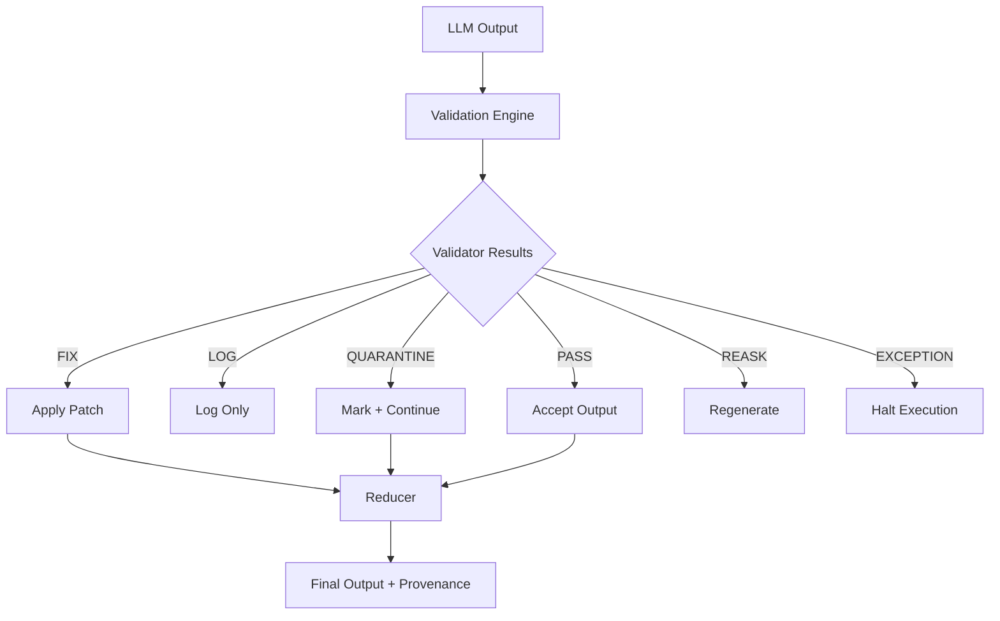

# Architecture: Agent Validation Provenance

This document describes the runtime validation architecture with explicit mutation tracking and quarantine semantics.

---

## 1. High-level Flow



---

## 2. Key Concept: Mutation Visibility

Traditional systems:

```
LLM → Validator → Fixed Output (silent mutation)
```

This system:

```
LLM → Validator → ValidationPatch → StateReducer → Observable Output
```

---

## 3. State Layers

### Raw State
Original LLM output (never mutated)

### Patch Layer
Each validator emits structured patches:

- field changed
- reason
- confidence
- action type

### Final State
Reduced view after applying FIX + QUARANTINE logic

---

## 4. QUARANTINE Semantics

QUARANTINE is not failure.

It represents:

- uncertain validity
- soft constraint violation
- downstream decision deferred

---

## 5. Provenance Tracking

Final output includes:

- mutation ratio
- number of fixed fields
- number of quarantined fields

This enables:

- drift detection
- debugging multi-step agents
- auditability of LLM transformations

---

## 6. Position in LLM System Stack

| Layer | System |
|------|--------|
| Evaluation | RAGAS / TruLens |
| Runtime Guard | Guardrails |
| Orchestration | LangGraph |
| Execution Control | This System |

---

## 7. Design Goal

Move from:

> opaque correction systems

to:

> observable validation state machines with replayable mutations
